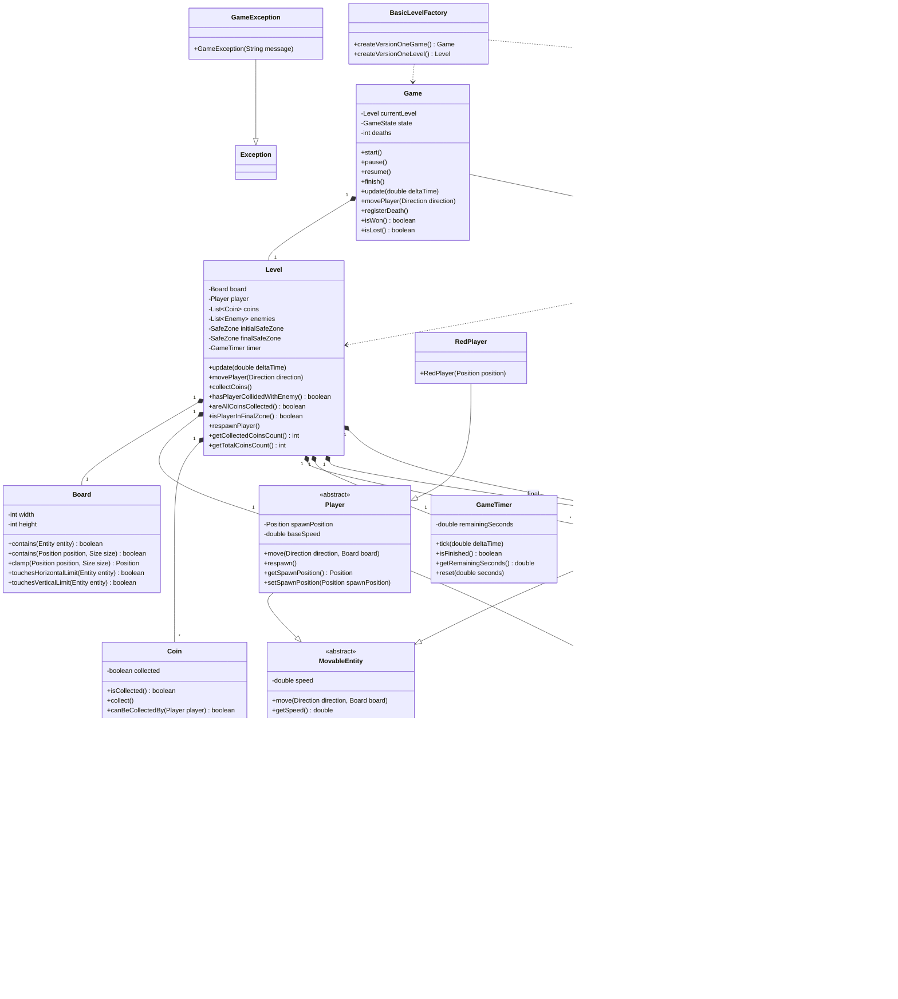

# Diagrama de clases - Dominio Version 1

```mermaid
classDiagram
    class Game {
        -Level currentLevel
        -GameState state
        -int deaths
        +start()
        +pause()
        +resume()
        +finish()
        +update(double deltaTime)
        +movePlayer(Direction direction)
        +registerDeath()
        +isWon() boolean
        +isLost() boolean
    }

    class Level {
        -Board board
        -Player player
        -List~Coin~ coins
        -List~Enemy~ enemies
        -SafeZone initialSafeZone
        -SafeZone finalSafeZone
        -GameTimer timer
        +update(double deltaTime)
        +movePlayer(Direction direction)
        +collectCoins()
        +hasPlayerCollidedWithEnemy() boolean
        +areAllCoinsCollected() boolean
        +isPlayerInFinalZone() boolean
        +respawnPlayer()
        +getCollectedCoinsCount() int
        +getTotalCoinsCount() int
    }

    class Board {
        -int width
        -int height
        +contains(Entity entity) boolean
        +contains(Position position, Size size) boolean
        +clamp(Position position, Size size) Position
        +touchesHorizontalLimit(Entity entity) boolean
        +touchesVerticalLimit(Entity entity) boolean
    }

    class Entity {
        <<abstract>>
        -Position position
        -Size size
        +getPosition() Position
        +getSize() Size
        +setPosition(Position position)
        +collidesWith(Entity other) boolean
    }

    class MovableEntity {
        <<abstract>>
        -double speed
        +move(Direction direction, Board board)
        +getSpeed() double
    }

    class Player {
        <<abstract>>
        -Position spawnPosition
        -double baseSpeed
        +move(Direction direction, Board board)
        +respawn()
        +getSpawnPosition() Position
        +setSpawnPosition(Position spawnPosition)
    }

    class RedPlayer {
        +RedPlayer(Position position)
    }

    class Enemy {
        <<abstract>>
        -Direction direction
        +update(Board board, double deltaTime)
        +getDirection() Direction
        +setDirection(Direction direction)
    }

    class BasicBlueEnemy {
        +update(Board board, double deltaTime)
        +bounceIfNeeded(Board board)
    }

    class Coin {
        -boolean collected
        +isCollected() boolean
        +collect()
        +canBeCollectedBy(Player player) boolean
    }

    class SafeZone {
        -SafeZoneType type
        +getType() SafeZoneType
        +contains(Player player) boolean
    }

    class GameTimer {
        -double remainingSeconds
        +tick(double deltaTime)
        +isFinished() boolean
        +getRemainingSeconds() double
        +reset(double seconds)
    }

    class Position {
        -double x
        -double y
        +getX() double
        +getY() double
        +translatedBy(double dx, double dy) Position
    }

    class Size {
        -double width
        -double height
        +getWidth() double
        +getHeight() double
    }

    class GameException {
        +GameException(String message)
    }

    class BasicLevelFactory {
        +createVersionOneGame() Game
        +createVersionOneLevel() Level
    }

    class Direction {
        <<enumeration>>
        UP
        DOWN
        LEFT
        RIGHT
        UP_LEFT
        UP_RIGHT
        DOWN_LEFT
        DOWN_RIGHT
        NONE
    }

    class GameState {
        <<enumeration>>
        READY
        RUNNING
        PAUSED
        WON
        LOST
        FINISHED
    }

    class SafeZoneType {
        <<enumeration>>
        INITIAL
        FINAL
    }

    Game "1" *-- "1" Level
    BasicLevelFactory ..> Game
    BasicLevelFactory ..> Level
    Game --> GameState
    Level "1" *-- "1" Board
    Level "1" *-- "1" Player
    Level "1" *-- "*" Coin
    Level "1" *-- "*" Enemy
    Level "1" *-- "1" GameTimer
    Level "1" *-- "1" SafeZone : initial
    Level "1" *-- "1" SafeZone : final

    Entity *-- Position
    Entity *-- Size
    MovableEntity --|> Entity
    Player --|> MovableEntity
    RedPlayer --|> Player
    Enemy --|> MovableEntity
    BasicBlueEnemy --|> Enemy
    Coin --|> Entity
    SafeZone --|> Entity

    Enemy --> Direction
    Player --> Direction
    SafeZone --> SafeZoneType
    GameException --|> Exception
```
