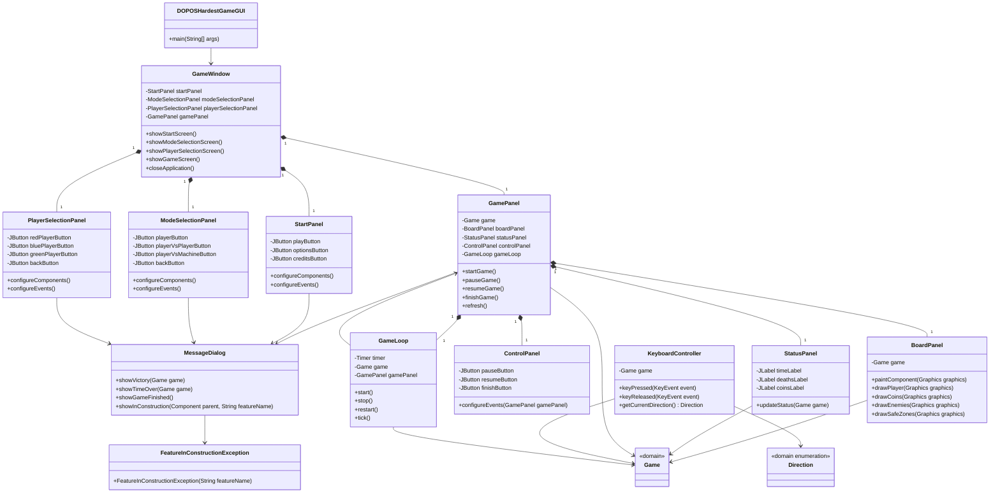

# Diagrama de clases - Presentacion Version 1

```mermaid
classDiagram
    class GameWindow {
        -StartPanel startPanel
        -ModeSelectionPanel modeSelectionPanel
        -PlayerSelectionPanel playerSelectionPanel
        -GamePanel gamePanel
        +showStartScreen()
        +showModeSelectionScreen()
        +showPlayerSelectionScreen()
        +showGameScreen()
        +closeApplication()
    }

    class DOPOSHardestGameGUI {
        +main(String[] args)
    }

    class StartPanel {
        -JButton playButton
        -JButton optionsButton
        -JButton creditsButton
        +configureComponents()
        +configureEvents()
    }

    class ModeSelectionPanel {
        -JButton playerButton
        -JButton playerVsPlayerButton
        -JButton playerVsMachineButton
        -JButton backButton
        +configureComponents()
        +configureEvents()
    }

    class PlayerSelectionPanel {
        -JButton redPlayerButton
        -JButton bluePlayerButton
        -JButton greenPlayerButton
        -JButton backButton
        +configureComponents()
        +configureEvents()
    }

    class GamePanel {
        -Game game
        -BoardPanel boardPanel
        -StatusPanel statusPanel
        -ControlPanel controlPanel
        -GameLoop gameLoop
        +startGame()
        +pauseGame()
        +resumeGame()
        +finishGame()
        +refresh()
    }

    class BoardPanel {
        -Game game
        +paintComponent(Graphics graphics)
        +drawPlayer(Graphics graphics)
        +drawCoins(Graphics graphics)
        +drawEnemies(Graphics graphics)
        +drawSafeZones(Graphics graphics)
    }

    class StatusPanel {
        -JLabel timeLabel
        -JLabel deathsLabel
        -JLabel coinsLabel
        +updateStatus(Game game)
    }

    class ControlPanel {
        -JButton pauseButton
        -JButton resumeButton
        -JButton finishButton
        +configureEvents(GamePanel gamePanel)
    }

    class KeyboardController {
        -Game game
        +keyPressed(KeyEvent event)
        +keyReleased(KeyEvent event)
        +getCurrentDirection() Direction
    }

    class GameLoop {
        -Timer timer
        -Game game
        -GamePanel gamePanel
        +start()
        +stop()
        +restart()
        +tick()
    }

    class MessageDialog {
        +showVictory(Game game)
        +showTimeOver(Game game)
        +showGameFinished()
        +showInConstruction(Component parent, String featureName)
    }

    class FeatureInConstructionException {
        +FeatureInConstructionException(String featureName)
    }

    class Game {
        <<domain>>
    }

    class Direction {
        <<domain enumeration>>
    }

    DOPOSHardestGameGUI --> GameWindow
    GameWindow "1" *-- "1" StartPanel
    GameWindow "1" *-- "1" ModeSelectionPanel
    GameWindow "1" *-- "1" PlayerSelectionPanel
    GameWindow "1" *-- "1" GamePanel
    GamePanel "1" *-- "1" BoardPanel
    GamePanel "1" *-- "1" StatusPanel
    GamePanel "1" *-- "1" ControlPanel
    GamePanel "1" *-- "1" GameLoop
    BoardPanel --> Game
    StatusPanel --> Game
    GamePanel --> Game
    KeyboardController --> Game
    KeyboardController --> Direction
    GameLoop --> Game
    GameLoop --> GamePanel
    GamePanel --> MessageDialog
    StartPanel --> MessageDialog
    ModeSelectionPanel --> MessageDialog
    PlayerSelectionPanel --> MessageDialog
    MessageDialog --> FeatureInConstructionException
```
